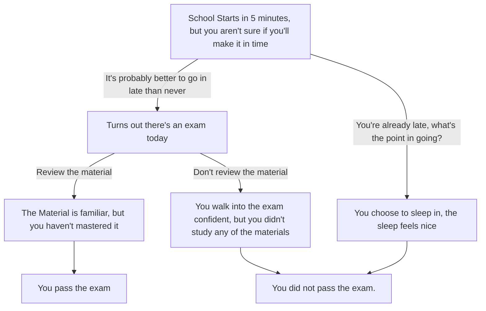

### The begining of the adventure is labeled "Start" this entity branches into two possibilities, those are labeled "**School**" and "**Stay**."

The reason for these options is because usually people choose to either sleep in or go to school despite being late
* **Stay** leads to **End**
   * Skipping school is very unhealthy, especially in this context where you had an important exam you forgot about
* **School** leads to two possibilities, those being "**Study**" or "**Enter**"
  * **Enter** leads to **End**. Even if you're confident in yourself, you should still study
  * **Study** leads to **Win**. Studying has been proven to improve grades and is important if you want to become a better student
